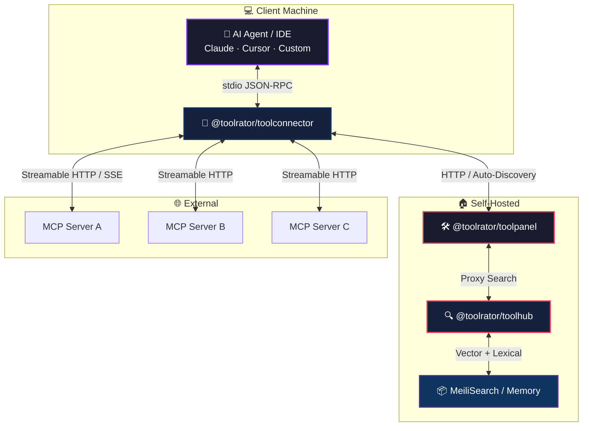

<div align="center">
  

  <br/><br/>

  <h1>🛰️ Toolrator Open Source</h1>
  <p>
    <b>Lightweight, Local &bull; Open Infrastructure for the Model Context Protocol (MCP)</b>
  </p>

  <br/>

  <!-- Top Badges Row -->
  <p>
    <a href="https://github.com/toolrator/toolrator"></a>
    <a href="LICENSE"></a>
    <a href="https://modelcontextprotocol.io/specification/2026-07-28"></a>
    <a href="https://nodejs.org"></a>
  </p>

  <!-- Package Badges -->
  <p>
    <a href="https://www.npmjs.com/package/@toolrator/toolconnector"></a>
    <a href="https://www.npmjs.com/package/@toolrator/toolpanel"></a>
  </p>

  <!-- CI Badges -->
  <p>
    
    
    
  </p>
</div>

<br/>

<!-- ==================== QUOTE ==================== -->

> **The local-first discovery layer for the AI agent era.**  
> `@toolrator/toolconnector` bridges any MCP-compatible AI client to search backends and external servers — all without leaving your machine.

<br/>

---

<div align="center">
  <a href="#overview">📋 Overview</a> &nbsp;•&nbsp;
  <a href="#packages">📦 Packages</a> &nbsp;•&nbsp;
  <a href="#architecture">🏗️ Architecture</a> &nbsp;•&nbsp;
  <a href="#quick-start">⚡ Quick Start</a> &nbsp;•&nbsp;
  <a href="#protocol-compliance">✅ Compliance</a> &nbsp;•&nbsp;
  <a href="#faq">❓ FAQ</a> &nbsp;•&nbsp;
  <a href="#contributing">🤝 Contributing</a> &nbsp;•&nbsp;
  <a href="#license">📄 License</a>
</div>

---

<!-- ==================== HIGHLIGHTS ==================== -->

## 🚀 Highlights

<br/>

| | |
|---|---|
| **🧠 MCP 2026-07-28 (official)** | First-mover on the stateless protocol — SEP-2575, MRTR, Tasks extension, Streamable HTTP |
| **🔌 Zero-Config Setup** | `npx -y @toolrator/toolconnector` — one command, four unified tools, instant discovery |
| **🔍 Typo-Tolerant Search** | MeiliSearch + ONNX hybrid vector search for finding MCP servers and tools |
| **🏠 Self-Hostable** | Toolpanel + Toolhub run fully offline — no cloud dependency |
| **📋 4-Tool Surface** | Minimal context window footprint: search, inspect, execute, auth, bookmarks |
| **🔄 Auto-Fallback** | Works with both `2026-07-28` draft and legacy `2025-11-25` servers |

<br/>

---

<!-- ==================== OVERVIEW ==================== -->

## 📋 Overview

This repository publishes the open-source client and discovery infrastructure for the Model Context Protocol. Three packages, one ecosystem:

> 🔐 **Authentication**: By default, the toolconnector uses `https://toolrator.com` as its upstream auth endpoint (device flow, API key verification, search config). Set `TOOLPANEL_URL=http://127.0.0.1:7800` to use a self-hosted toolpanel instead — no external dependency.

<br/>

<div align="center">

| Package | Type | Run | Description |
| :--- | :--- | :--- | :--- |
| **🔌 `toolconnector`** | NPM CLI & Library | `npx -y @toolrator/toolconnector` | Local stdio MCP bridge — connects AI agents to search backends and external MCP servers |
| **🛠️ `toolpanel`** | NPM CLI & Package | `npx -y @toolrator/toolpanel` | Self-hosted control panel — auth device flow, search-engine config, admin UI |
| **🔍 `toolhub`** | Server Package | `npm run dev` | Typo-tolerant + hybrid vector search engine — MeiliSearch or in-memory backend |

</div>

<br/>

<br/>

---

<!-- ==================== PACKAGES ==================== -->

## 📦 Packages

<br/>

<div align="center">

### 🔌 `@toolrator/toolconnector`

[](https://www.npmjs.com/package/@toolrator/toolconnector)
[](https://github.com/toolrator/toolrator/actions)
[](https://www.typescriptlang.org/)

**The universal MCP adapter.** A stdio server that exposes 4 unified tools to any MCP-compatible AI client:

</div>

<br/>

| Tool | Purpose | Key Parameters |
| :--- | :--- | :--- |
| `search_mcp_ecosystem` | Search registry for tools, resources, prompts | `engine`, `arguments` |
| `mcp_server` | Generic JSON-RPC passthrough to any external MCP (list, call, fetch, tasks) | `target`, `method`, `params` |
| `manage_auth` | Device-flow login & status | `action`, `device_code` |
| `manage_favorites` | Bookmark servers with cross-session notes | `action`, `target`, `notes` |
| — | **MRTR support**, **Tasks extension**, **Pluggable search engines** | |

<br/>

<div align="center">

### 🛠️ `@toolrator/toolpanel`

[](https://www.npmjs.com/package/@toolrator/toolpanel)
[](https://www.typescriptlang.org/)

**Drop-in replacement for the upstream SaaS endpoint.** Self-hosted control plane for toolconnector and toolhub.

</div>

<br/>

| Feature | Endpoint | Description |
| :--- | :--- | :--- |
| Landing page | `/` | Status-aware cards for toolconnector & toolhub |
| Connector config | `/panel/toolconnector` | CRUD for search-engines.json |
| Public search | `/panel/search` | Queries toolhub with faceted filters |
| Search admin | `/panel/search/admin` | Index / edit / delete MCP servers |
| Device flow | `/device` | One-tap paste, real-time validation |

<br/>

<div align="center">

### 🔍 `@toolrator/toolhub`

[](https://www.npmjs.com/package/@toolrator/toolhub)
[](https://www.typescriptlang.org/)

**High-performance search engine** with typo tolerance, faceted filtering, and hybrid vector search.

</div>

<br/>

- **Two backends**: MeiliSearch (production) or in-memory (dev)
- **ONNX embeddings**: `Xenova/multilingual-e5-small` — 384-dim local vector search
- **Tool-level matching**: `toolHits` extracted from `capabilities.tools`
- **LRU caching**: Search results (60s) and query embeddings (1h)

<br/>

---

<!-- ==================== ARCHITECTURE ==================== -->

## 🏗️ Architecture

<br/>



<br/>

---

<!-- ==================== QUICK START ==================== -->

## ⚡ Quick Start

<br/>

### 🐳 Stack: Run everything locally

<details open>
<summary><b>Step 1 — Start the search engine</b></summary>

```bash
cd packages/toolhub
npm install
SEARCH_BACKEND=memory npm run dev
# → http://127.0.0.1:7600
```

</details>

<br/>

<details open>
<summary><b>Step 2 — Start the control panel</b></summary>

```bash
npx -y @toolrator/toolpanel
# → http://127.0.0.1:7800
```

</details>

<br/>

<details open>
<summary><b>Step 3 — Connect your AI agent</b></summary>

Add to your MCP client config:

```json
{
  "mcpServers": {
    "toolconnector": {
      "command": "npx",
      "args": ["-y", "@toolrator/toolconnector"]
    }
  }
}
```

</details>

<br/>

> 💡 **Offline mode**: Set `TOOLPANEL_URL=http://127.0.0.1:7800` and `CONNECTOR_SEARCH_CONFIG_MODE=toolpanel` for a fully self-contained setup.

<br/>

---

<!-- ==================== COMPLIANCE ==================== -->

## ✅ Protocol Compliance

<br/>

The Toolrator OSS stack is built against **MCP 2026-07-28** — the official stable revision of the Model Context Protocol (released 2026-07-28). Every applicable feature is implemented and tested.

<br/>

| Feature | SEP | Status | Detail |
| :--- | :--- | :---: | :--- |
| Stateless protocol (no `initialize`) | SEP-2575 | ✅ | Per-request `_meta` carries `protocolVersion`, `clientCapabilities` |
| `server/discover` RPC | SEP-2575 | ✅ | Auto-probed on every connection |
| Streamable HTTP transport | SEP-2243 | ✅ | Primary transport; SSE fallback for legacy |
| Multi Round-Trip Requests | SEP-2322 | ✅ | `input_required` / `inputResponses` / `requestState` |
| Tasks extension | SEP-2663 | ✅ | `tasks/get`, `tasks/update`, `tasks/cancel` |
| `CacheableResult` (`ttlMs`/`cacheScope`) | SEP-2549 | ✅ | Client-side caching on `tools/list`, `resources/list`, `prompts/list` |
| JSON Schema 2020-12 | SEP-2106 | ✅ | Default dialect; `outputSchema` on tool definitions |
| Error codes `-32020`/`-32021`/`-32022` | — | ✅ | Classified by `classifyUpstreamError()` |
| x402 payments | SEP-2009 | ⏳ | Deferred — awaiting spec stabilization |
| OpenTelemetry tracing | SEP-414 | ➖ | N/A (optional) |

<br/>

<details>
<summary><b>🔬 Full compliance matrix</b> (per-feature tracking with test references)</summary>
<br/>

See **[`packages/toolconnector/MCP-FEATURES.md`](./packages/toolconnector/MCP-FEATURES.md)** for the complete 185-line matrix covering all 13 feature areas — base protocol, transport, state management, caching, MRTR, Tasks, error codes, auth, schema, subscriptions, deprecated features, SDK migration, and payments roadmap.

</details>

<br/>

<details>
<summary><b>🔄 Legacy compatibility</b></summary>
<br/>

Servers running `2025-11-25` are handled automatically. The SDK's `versionNegotiation: { mode: 'auto' }` probes via `server/discover` first; if the server doesn't support the `2026-07-28` revision, it falls back to the `initialize` handshake transparently.

</details>

<br/>

---

<!-- =================== CONFIGURATION ==================== -->

## ⚙️ Configuration

<br/>

<details>
<summary><b>Environment Variables</b></summary>
<br/>

| Variable | Default | Purpose |
| :--- | :--- | :--- |
| `CONNECTOR_API_KEY` | — | Pre-configured API key (skips device flow) |
| `CONNECTOR_CONFIG_DIR` | OS default | Credentials, favorites, search-engines |
| `CONNECTOR_UPSTREAM_URL` | `https://toolrator.com` | Auth endpoint base URL |
| `TOOLPANEL_URL` | `http://127.0.0.1:7800` | Self-hosted control panel URL |
| `TOOLPANEL_DISCOVERY` | `auto` | Probe toolpanel at boot |
| `CONNECTOR_SEARCH_CONFIG_MODE` | `auto` | Engine resolution strategy |
| `CONNECTOR_LOG_LEVEL` | `info` | Log verbosity |

</details>

<br/>

<details>
<summary><b>Config paths (by OS)</b></summary>
<br/>

| OS | Config Directory |
| :--- | :--- |
| **Windows** | `%APPDATA%\toolconnector\` |
| **macOS** | `~/Library/Application Support/toolconnector/` |
| **Linux** | `$XDG_CONFIG_HOME/toolconnector/` or `~/.config/toolconnector/` |

</details>

<br/>

---

<!-- ===================== FAQ ======================== -->

## ❓ FAQ

<br/>

<details>
<summary><b>Can I self-host everything without internet?</b></summary>
<br/>
Yes. Run Toolpanel + Toolhub locally. Point `TOOLPANEL_URL=http://127.0.0.1:7800` and set `CONNECTOR_SEARCH_CONFIG_MODE=toolpanel` — no cloud dependency.
</details>

<br/>

<details>
<summary><b>Which AI clients are compatible?</b></summary>
<br/>
Any client that supports <b>stdio MCP servers</b>: Claude Desktop, Cursor, VS Code (GitHub Copilot), and custom agent frameworks.
</details>

<br/>


<details>
<summary><b>Can I add custom search backends?</b></summary>
<br/>
Yes. Add entries to <code>search-engines.json</code> or configure via Toolpanel's admin UI. Supports HTTP, MCP-HTTP, MCP-SSE, and MCP-stdio transports.
</details>

<br/>

<details>
<summary><b>What's the license?</b></summary>
<br/>
<b>Apache 2.0</b> — free to use, modify, and distribute. See <a href="LICENSE">LICENSE</a>.
</details>

<br/>

---

<!-- ==================== CONTRIBUTING ==================== -->

## 🤝 Contributing

<br/>

<div align="center">

We welcome contributions from **humans and AI agents** alike.

</div>

<br/>

<details>
<summary><b>📝 Workflow</b></summary>
<br/>

| Step | Action |
| :--- | :--- |
| 1 | Clone the repo and `cd packages/<package>` |
| 2 | `npm install` |
| 3 | Make your changes |
| 4 | Run tests: `npm test` (Node.js built-in `node --test`, no Jest/Vitest) |
| 5 | Typecheck: `npm run typecheck` |
| 6 | Open a PR against `main` |

</details>

<br/>

<details>
<summary><b>🔍 Getting Help</b></summary>
<br/>

- **Docs**: [`CONTRIBUTING.md`](./CONTRIBUTING.md) · [`CODE_OF_CONDUCT.md`](./CODE_OF_CONDUCT.md)
- **Issues**: [GitHub Issues](https://github.com/toolrator/toolrator/issues)
- **Security**: `security@toolrator.com`

</details>

<br/>

---

<!-- ==================== LICENSE ==================== -->

## 📄 License

<br/>

<div align="center">
  <a href="LICENSE"></a>

  <br/><br/>

  <sub>Built for the AI Agent Era. 🛰️</sub>
</div>
