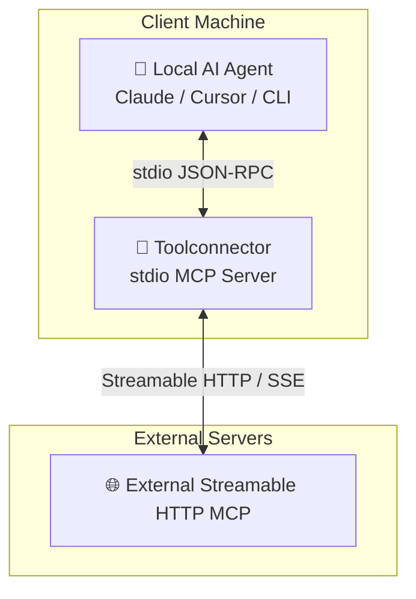
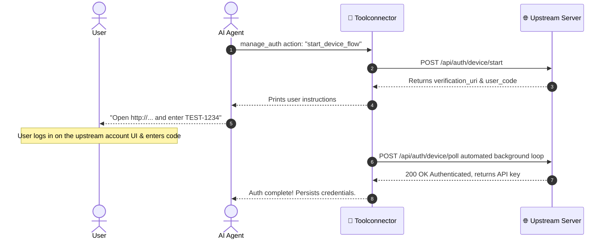

# 🔌 Toolconnector

**The local stdio bridge connecting any local AI agent to search-engine backends (via toolpanel or any compatible upstream).**

[](https://www.apache.org/licenses/LICENSE-2.0)
[](https://modelcontextprotocol.io/specification/2026-07-28)
[](#)

---

## 🟢 Project Status

**v0.1.0** — Adopts [MCP 2026-07-28](https://modelcontextprotocol.io/specification/2026-07-28) (official stable revision: stateless, per-request capabilities, MRTR, Tasks extension). See [`MCP-FEATURES.md`](./MCP-FEATURES.md) for the full compliance matrix.

**Requirements**: Node.js >= 20.

---

## 📦 Installation

This package is published publicly on the NPM registry. You can run it instantly using `npx`:

```bash
npx -y @toolrator/toolconnector
```

Alternatively, you can install it globally:

```bash
npm install -g @toolrator/toolconnector
```

---

## 🎯 What is Toolconnector?

The **Toolconnector** is a lightweight, local **stdio Model Context Protocol (MCP) server** designed to run directly on the client machine. 

`toolconnector` acts as the **universal adapter**. By installing `toolconnector` locally, your local AI agent gains instant, secure, and authenticated access to any configured search-engine backend (via toolpanel or a compatible upstream) and external MCP servers.

Since v0.1.0, the tool interface has been simplified to exactly **4 unified, powerful tools** to optimize the context window for LLMs.

---

## 🏗️ How it Works (Architecture)




---

## 🛠️ Unified Tool Specifications

The `toolconnector` exposes exactly **4 client-facing tools** to your AI agent:

### 1. `search_mcp_ecosystem`
* **Purpose**: Search the configured search ecosystem (and any custom search engines) for tools, resources, or prompts.
* **Parameters**:
  * `engine` (enum, required): Which configured search engine to query (see [Pluggable Search Engines](#-pluggable-search-engines)). When no custom engines are set, the implicit `${CONNECTOR_PRODUCT_NAME}-default` engine (default id `toolconnector-default`) is pre-registered and must be selected explicitly; if no engines exist at all, the enum is `["none"]`.
  * `arguments` (record, required): Engine-specific search arguments, passed through to the engine as-is. The engine's schema (`schemaUrl`) is fetched and surfaced in the tool description to guide argument construction, but arguments are not validated at runtime.
* **Returns**: Search results in the shape defined by the selected engine's schema.

### 2. `mcp_server`
* **Purpose**: Generic JSON-RPC passthrough to any external MCP server — list tools/resources/prompts, call tools, fetch content, and manage long-running tasks by supplying the protocol `method` + `params`. The server's raw response is returned.
* **Parameters**:
  * `target` (string, required): External http(s) URL of the MCP server.
  * `method` (string, required): MCP JSON-RPC method, e.g. `tools/list`, `tools/call`, `resources/list`, `resources/read`, `prompts/list`, `prompts/get`, `tasks/get`, `tasks/update`, `tasks/cancel`. Any app-level method is forwarded; protocol plumbing (`initialize`, `ping`, `notifications/*`) is blocked — the connector manages the connection.
  * `params` (record, optional): JSON-RPC params object — e.g. `{ name, arguments }` for `tools/call`, `{ uri }` for `resources/read`, `{ name, arguments }` for `prompts/get`, `{ taskId, status }` for `tasks/update`.
* **Behavior notes**:
  * `tools/list` responses with more than 6 tools are summarized transparently (each tool shows a `param_hint` listing its parameters) to save context; smaller listings return full `inputSchema`s.
  * Long-running `tools/call` responses may carry `_meta.task_id` — poll it with `tasks/get`.
  * Elicitation (`resultType: "input_required"`) is supported: retry `tools/call` with `params { requestState, inputResponses }`.
  * Unknown methods are forwarded raw; errors are classified into structured error types (`auth_required`, `resource_not_found`, `header_mismatch`, etc.).
* **Returns**: The server's raw response envelope (with trust-level and prompt-injection warning).

### 3. `manage_auth`
* **Purpose**: Manage passwordless device-flow authentication and check account status.
* **Parameters**: 
  * `action` (`"status" | "start_device_flow" | "poll_device_flow" | "logout"`, required): The auth action to perform. Dynamically scoped by state: `"status"` and `"logout"` when authenticated; `"status"`, `"start_device_flow"`, and `"poll_device_flow"` when anonymous (or while a device flow is pending).
  * `device_code` (string, optional): Required for manual polling.
* **Returns**: Login state, verification URL and user code, or confirmation status.

### 4. `manage_favorites`
* **Purpose**: Manage local MCP server bookmarks with cross-session custom memory notes.
* **Parameters**:
  * `action` (`"list" | "add" | "remove"`, required).
  * `target` (string, optional): Required for add/remove.
  * `notes` (string, optional): Free-text troubleshooting notes to associate with the bookmarked server.
* **Returns**: List of bookmarks or confirmation.

---

## 🔐 Timed Passwordless Device Flow Auth

To log in and access authenticated MCP servers, the connector implements a passwordless device flow:



---

The connector also uses `POST /api/auth/verify-key` (with retry/backoff) to validate stored API keys and `GET /api/connector/config/auto` to fetch the authoritative search-engine list — self-hosted upstreams must implement both. A stored API key that keeps failing verification (401 on all retries) logs the user out and clears stored credentials.

## ⚠️ Structured Error Architecture

When a tool execution against an upstream MCP server fails, `mcp_server` with `method: "tools/call"` returns a structured JSON payload rather than a plain string:

```json
{
  "error_code": "auth_required",
  "reason": "upstream_auth",
  "required_step": "Call manage_auth with action: 'start_device_flow'",
  "memory_note": "Free-text custom notes associated with your favorites bookmark"
}
```

Standard error codes:
* `auth_required` (401 — upstream server requires authentication)
* `server_not_found` (404 — lookup error)
* `tool_not_found` (-32601 — unknown tool name)
* `resource_not_found` (-32602 — unknown resource)
* `unsupported_protocol_version` (-32022 — MCP version mismatch)
* `header_mismatch` (-32020 — HTTP header validation failure)
* `execution_failed` (catch-all for upstream errors)

---

## ⚡ Quick Start & Configuration

Since `toolconnector` is a standard stdio MCP server, it can be added to any compliant host.

### ⚙️ Environment Configuration

You can configure `toolconnector` via environment variables. Create a `.env` file in the package root or configure the variables globally on your system. A `.env.example` file is provided for reference:

```bash
# Copy the example config
cp .env.example .env
```

Available environment variables:

- `CONNECTOR_API_KEY`: Pre-configured API key (skips the device login flow if provided).
- `CONNECTOR_CONFIG_DIR`: Directory for storing local state (`credentials.json`, `favorites.json`, `search-engines.json`). Defaults to an OS-specific path (see [Config directory](#config-directory)).
- `CONNECTOR_UPSTREAM_URL`: Base URL for authentication endpoints (default: `https://toolrator.org`). Used as the neutral fallback so non-technical / remotely-hosted users without toolpanel still get the `auto` flow; override to point at your own upstream.
- `CONNECTOR_DEFAULT_UPSTREAM_URL`: Default base URL fallback when `CONNECTOR_UPSTREAM_URL` is unset (default: `https://toolrator.org`).
- `CONNECTOR_PRODUCT_NAME`: Product name driving product-derived identifiers — the config-dir subfolder, the implicit-default search-engine id (`<productName>-default`), and any user-facing string that mentions the product. The auth-management tool name itself (`manage_auth`) is fixed and NOT interpolated. Default: `toolconnector`.
- `TOOLPANEL_URL`: Base URL of a self-hostable **toolpanel** instance (default: `http://127.0.0.1:7800`). When set and active, the connector prefers toolpanel over `CONNECTOR_UPSTREAM_URL` for the authoritative search-engine config. See [`toolpanel`](../toolpanel).
- `TOOLPANEL_DISCOVERY`: `auto` (default) or `off`. When `auto`, the connector probes `TOOLPANEL_URL` at boot (and on each re-resolve) to decide if toolpanel is alive before preferring it. When `off`, the probe is skipped in `auto` mode — the connector goes straight to `CONNECTOR_UPSTREAM_URL`. Note: with `CONNECTOR_SEARCH_CONFIG_MODE=toolpanel`, the liveness probe always runs regardless of this setting.
- `TOOLPANEL_PROBE_PATH`: Path appended to `TOOLPANEL_URL` for the liveness probe (default: `/.well-known/toolpanel-alive`).
- `TOOLPANEL_PROBE_TIMEOUT_MS`: Probe timeout in milliseconds (default: `1500`).
- `CONNECTOR_LOG_LEVEL`: Log level: `debug`, `info`, `warn`, or `error` (default: `info`).
- `CONNECTOR_SEARCH_CONFIG`: Absolute path to a custom search-engines JSON file. Overrides the config-dir file (see [Pluggable Search Engines](#-pluggable-search-engines)).
- `CONNECTOR_SEARCH_CONFIG_MODE`: `auto` (default), `toolpanel`, or `file`. Controls how search engines are resolved.
  - `auto` — authenticated: prefer toolpanel (when `TOOLPANEL_URL` is set and reachable), fall back to `CONNECTOR_UPSTREAM_URL`, then to the local file. Unauthenticated: local file → implicit-default engine.
  - `toolpanel` — authenticated: only use toolpanel (`TOOLPANEL_URL` must be set and reachable). If toolpanel is unreachable, fall back to the local `search-engines.json` file; `CONNECTOR_UPSTREAM_URL` is never contacted.
  - `file` — always use the local `search-engines.json` (or `CONNECTOR_SEARCH_CONFIG`) and never pull from any server.
- `TOOLCONNECTOR_VERSION`: Connector version reported to MCP clients (default: derived from `package.json`).

### 💬 Claude Desktop Configuration
Add the following configuration to your `claude_desktop_config.json`:

```json
{
  "mcpServers": {
    "toolconnector": {
      "command": "npx",
      "args": [
        "-y",
        "@toolrator/toolconnector"
      ]
    }
  }
}
```

### Config directory

Local state is stored in `CONNECTOR_CONFIG_DIR`, or the following OS default (where `<productName>` is `CONNECTOR_PRODUCT_NAME`, default `toolconnector`):

- **Windows**: `%APPDATA%\<productName>`
- **macOS**: `~/Library/Application Support/<productName>`
- **Linux**: `$XDG_CONFIG_HOME/<productName>` (falls back to `~/.config/<productName>`)

This directory holds `credentials.json`, `favorites.json`, `search-engines.json`, and a `schemas/` subdirectory (a per-engine cache of schemas fetched from each engine's `schemaUrl`).

---

## 🔍 Pluggable Search Engines

By default, `search_mcp_ecosystem` queries the implicit-default engine (id `${CONNECTOR_PRODUCT_NAME}-default`, default `toolconnector-default`) pointing at the resolved upstream's `/api/search`. You can add custom search backends (private, self-hosted, or third-party indexes) that show up as selectable `engine` values on that tool.

### Where to configure

Engines are defined as a **JSON array** in a file named `search-engines.json`. It is resolved in this order:

1. `CONNECTOR_SEARCH_CONFIG` — absolute path to a JSON file, if set.
2. `<config-dir>/search-engines.json` — see [Config directory](#config-directory) (e.g. `%APPDATA%\toolconnector\search-engines.json` on Windows).
3. Implicit default — a single `${CONNECTOR_PRODUCT_NAME}-default` engine pointing at `${CONNECTOR_UPSTREAM_URL}/api/search`.

A ready-to-copy template is provided in [`search-engines.example.json`](./search-engines.example.json).

### Resolution mode (`CONNECTOR_SEARCH_CONFIG_MODE`)

- **`auto`** (default): When authenticated, the connector pulls the authoritative engine list **preferentially from your toolpanel instance** (if `TOOLPANEL_URL` is set and reachable), otherwise from your configured upstream (`CONNECTOR_UPSTREAM_URL`), and **overwrites the local `search-engines.json`** as a cache. Your local edits are only used when unauthenticated, toolpanel is unreachable, and `CONNECTOR_UPSTREAM_URL` is unreachable or returns a non-200. Manage engines from your toolpanel or upstream account UI.
- **`toolpanel`**: The connector only uses `${TOOLPANEL_URL}/api/connector/config/auto` as the authoritative source when authenticated. If toolpanel is unreachable, it falls back to the local `search-engines.json` file and never contacts `CONNECTOR_UPSTREAM_URL`. Use this to guarantee a self-hosted control panel is the source of truth whenever it's online.
- **`file`**: The connector always uses the local `search-engines.json` (or `CONNECTOR_SEARCH_CONFIG`) and never pulls from any server. Use this if you want your local file edits to be authoritative.

### Engine schema

Each entry is validated against the following structure. Unknown fields are ignored.

```json
{
  "id": "internal-wiki",
  "label": "Internal Wiki Search",
  "transport": "http",
  "endpoint": "http://localhost:4034/search",
  "schemaUrl": "http://localhost:4034/schema",
  "notes": "Queries internal docs. Use for company policy or dev guidelines.",
  "timeoutMs": 5000,
  "enabled": true
}
```

| Field | Required | Description |
| --- | --- | --- |
| `id` | yes | Lowercase kebab-case ID (`^[a-z0-9-]+$`), max 64 chars. Must be unique; duplicates are skipped. |
| `label` | yes | Human-readable name, max 80 chars. |
| `transport` | yes | `"http"`, `"mcp-http"`, `"mcp-sse"`, or `"mcp-stdio"`. |
| `endpoint` | yes | Endpoint URL, or the command to run for `mcp-stdio`. |
| `args` | for `mcp-stdio` | Command arguments array. Required when `transport` is `"mcp-stdio"`. |
| `schemaUrl` | no | URL to the engine's argument schema (fetched and surfaced in the `search_mcp_ecosystem` tool description; arguments are passed through unvalidated). |
| `auth` | no | `{ "type": "bearer" \| "basic" \| "header", "tokenEnv": "ENV_VAR", "headerName": "X-..." }`. `headerName` is required when `type` is `"header"`. |
| `notes` | no | Free-text note, max 500 chars. |
| `timeoutMs` | no | Request timeout in ms (default `10000`). |
| `enabled` | no | Set `false` to keep the config but skip registering the engine (default `true`). |

> **HTTP behavior**: The implicit default engine (and any engine with id `toolhub-default`) is queried via legacy `GET /api/search?q=&limit=&offset=`; custom `http` engines are queried via `POST` to `endpoint` with the JSON arguments as body. `mcp-http` / `mcp-sse` engines call the `search` tool on the remote MCP server; `mcp-stdio` spawns `endpoint` with `args`.

> **Credentials**: never put secrets in the JSON. Use `auth.tokenEnv` to reference an environment variable; the connector reads the token from the environment at runtime and warns if it is missing.

---

## 🧪 Testing & Validation

### Run Tests Locally
Run the new native unit and E2E test suite using:

```bash
npm test
```

Or target specific test suites directly:

```bash
# Run E2E tests only
npm run test:e2e

# Run Compliance tests only
npm run test:compliance
```

### Typecheck

```bash
npm run typecheck
```

---

## 📋 Protocol Compliance

This package implements **MCP 2026-07-28** — the official stable revision of the Model Context Protocol (released 2026-07-28). Every applicable feature is implemented:

| Change | SEP | Status |
|---|---|---|
| Stateless protocol (no `initialize` handshake) | SEP-2575 | ✅ |
| `server/discover` / per-request `_meta` capabilities | SEP-2575 | ✅ |
| Streamable HTTP transport + SSE fallback | SEP-2243 | ✅ |
| Multi Round-Trip Requests (MRTR / `input_required`) | SEP-2322 | ✅ |
| Tasks extension (`tasks/get`, `tasks/update`, `tasks/cancel`) | SEP-2663 | ✅ |
| `CacheableResult` (`ttlMs`, `cacheScope`) | SEP-2549 | ✅ |
| Error codes `-32020`/`-32022` (`-32021` translated by SDK) | — | ✅ |

See the **[full compliance matrix → `MCP-FEATURES.md`](./MCP-FEATURES.md)** for the complete per-feature tracking with spec references and test linkages.

Legacy `2025-11-25` servers are handled automatically via SDK fallback negotiation.

---

## ❓ FAQ

**Q: Can I use this without an internet connection?**
A: Yes. Point `TOOLPANEL_URL` to a local toolpanel instance, or use `CONNECTOR_SEARCH_CONFIG_MODE=file` with a local `search-engines.json`.

**Q: Where is my config stored?**
A: See [Config directory](#config-directory) — OS-specific paths under `%APPDATA%`, `~/Library/Application Support`, or `~/.config`.

**Q: Does it work with any MCP client?**
A: Yes — any client that supports stdio MCP servers (Claude Desktop, Cursor, VS Code with GitHub Copilot, custom agents).

**Q: How do I add a custom search backend?**
A: Add an entry to `search-engines.json` (see [Pluggable Search Engines](#-pluggable-search-engines)) or configure it via toolpanel's admin UI.

---

## 🤝 Contributing

This package is part of the [Toolrator OSS ecosystem](https://github.com/toolrator/Toolrator).

- Run tests: `npm test`
- Typecheck: `npm run typecheck`
- Test runner: Node.js built-in `node --test` (no Jest/Vitest)

See [`CONTRIBUTING.md`](https://github.com/toolrator/Toolrator/blob/main/CONTRIBUTING.md) and [`CODE_OF_CONDUCT.md`](./CODE_OF_CONDUCT.md).

---

## 🙏 Acknowledgements

- [MCP SDK](https://github.com/modelcontextprotocol/sdk) — `@modelcontextprotocol/client` and `@modelcontextprotocol/server` v2
- [Hono](https://hono.dev/) — HTTP test harness framework
- [Zod](https://zod.dev/) — Schema validation

---

## 📄 License

Apache License 2.0 © Toolrator

